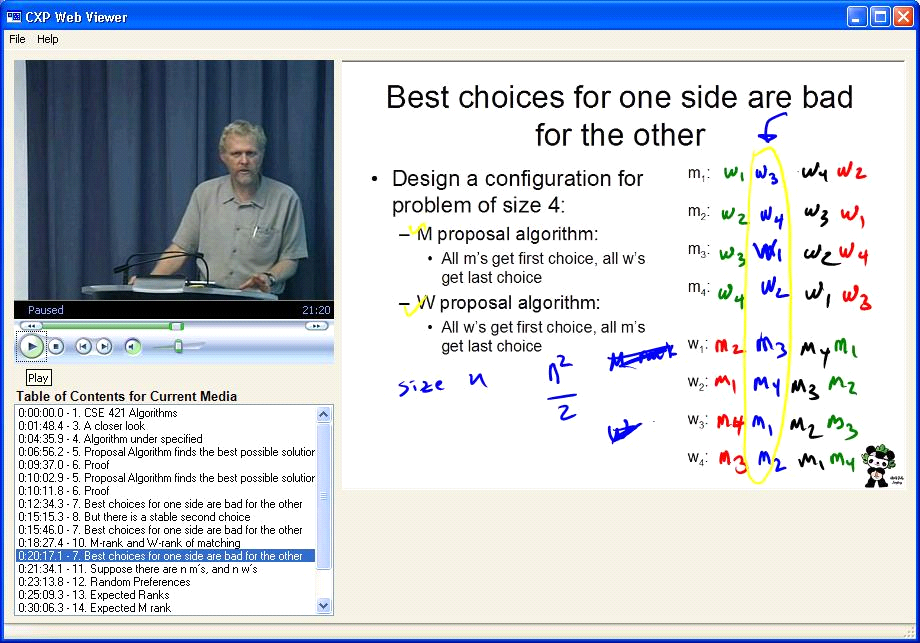

CXP WebViewer
=============

CXP WebViewer is a desktop client application which permits the playback of certain live video streams and video archives with synchronized sides and TabletPC ink annotations.  It embeds  Windows Media Player and contains a subset of Classroom Presenter functionality to display the audio, video and presentation.

CXP WebViewer was designed to support archives originating from ConferenceXP. 

CXP WebViewer is licensed under the Apache License v 2.0.

To build CXP WebViewer we recommend Visual Studio 2010 or 2012.  

CXP WebViewer Home with binary downloads and documentation: http://dada.cs.washington.edu/dl/confxp/webviewer.html

